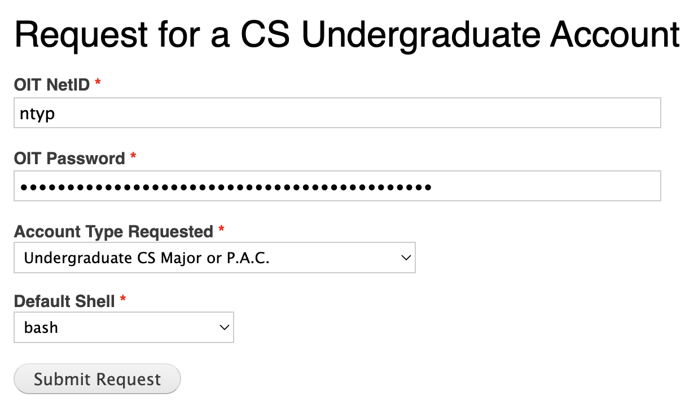
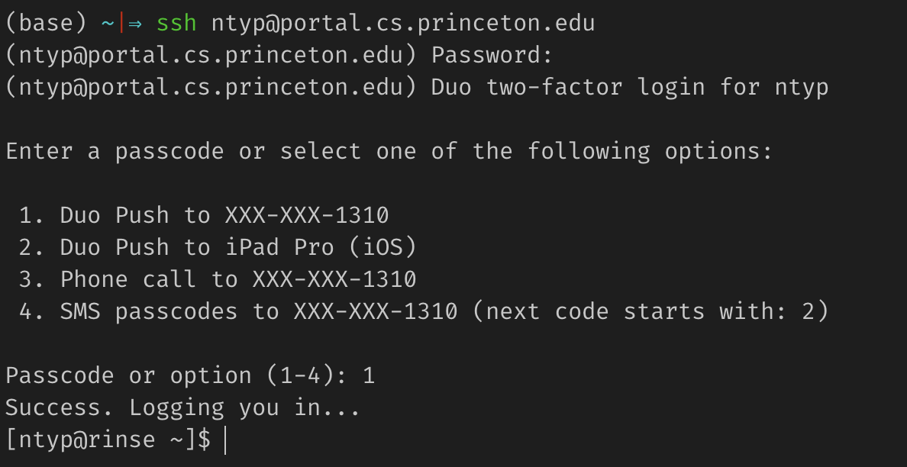

## Context

Student assignment submissions in COS 126/226 must be compiled and pushed to codePost before graders can access them. Below is a short guide for getting access to the COS 126/226 course servers and uploading a coding submission to codePost.

This guide was originally written by Nicholas Padmanabhan '23 (ntyp@princeton.edu) in November 2022.

If you've already completed the prerequisites, skip to the instructions (either for a [non-group](#uploading-a-submission-to-codepost-non-group-submission) or [group](#uploading-a-submission-to-codepost-group-submission) submission) for uploading a submission to codePost.

## Prerequisite 1: CS Undergraduate Account

If you don't have a CS Undergraduate Account (i.e. @cs.princeton.edu), follow these steps to get one.

1. Visit https://csguide.cs.princeton.edu/cs_request_forms_account and fill out the form. Select the Account Type and Default Shell shown in the image below.
   
1. Wait 1-2 days for your account to be created. Once it's created, you'll get a confirmation email. Be sure to reset your password and setup 2-factor authentication.

## Prerequisite 2: Generate & Upload SSH Key

If you haven't generated and uploaded an SSH key to the Department of Computer Science's SSH Key Manager, follow these steps (condensed from https://csguide.cs.princeton.edu/keymanager).

1. Complete prerequisite 1.
2. Open your terminal and SSH into portal.cs.princeton.edu (replace netID with your netID). Enter your password and complete 2-factor authentication as prompted.

```
$ ssh netID@portal.cs.princeton.edu
```



3. Change directory into `~/.ssh`...

```
$ cd ~/.ssh
```

4. ...or if it doesn't exist, create it with the correct permissions, and change into it.

```
$ mkdir ~/.ssh ; chmod 700 ~/.ssh ; cd ~/.ssh
```

5. Run the `ssh-keygen` command. **Specify id_rsa** as the filename, and **choose a strong password**. The fingerprint and random art will be different than what's shown below.

```
$ ssh-keygen
Generating public/private rsa key pair.
Enter file in which to save the key (/u/johndoe/.ssh/id_rsa): id_rsa
Enter passphrase (empty for no passphrase): <DO NOT USE AN EMPTY PASSPHRASE>
Enter same passphrase again: <SAME NON-EMPTY PASSPHRASE>
Your identification has been saved in id_rsa.
Your public key has been saved in id_rsa.pub.
The key fingerprint is: 09:e2:24:a7:d6:24:78:e5:df:9f:9c:5e:bf:2f:36:fc johndoe@hostname
The key's randomart image is:
+--[ RSA 2048]----+
|+oo. .. .        |
|oo ..  +         |
|  .   . .        |
|...      .       |
|oE.     S        |
|.o.o   . o       |
|o +     o =      |
|o.     . + .     |
|.                |
+-----------------+
```

6. Print your public key with `cat ~/.ssh/id_rsa.pub`:

```
$ cat ~/.ssh/id_rsa.pub
ssh-rsa AAAAB3NzaC1yc...a long string of characters...velTdiwV joeuser@hostname
```

7. Copy the output (starting with `ssh-rsa`) to your clipboard.
8. Log in to https://keymanager.cs.princeton.edu/keys/. Click Add New Key.
   
9. Give your key a decent label. Paste the SSH key from your clipboard into the Public Key field. Click Submit.
   

At this point, your public key will be automatically pushed to the appropriate course account(s). The mappings of TAs to courses are provided by Nicki or by the faculty instructors. In particular, ensure that a faculty instructor has enabled **CS Account Access** privileges for your netID.


The SSH keys are pushed out automatically for CS course accounts every hour at **15 minutes after the top of the hour**.

If you are having problems with your SSH key not working, please [contact csstaff](https://csguide.cs.princeton.edu/gethelp/csstaff) with the course account you are trying to use and on what system you are trying to access the course account either CS or OIT.

## Uploading a Submission to codePost (NON-GROUP SUBMISSION)

If a particular submission needs to be re-uploaded to codePost (including re-running tests), follow these steps.

1. Open your terminal and login to the course account. Replace `yourNetID` with your netID, and `courseName` with either `cos126` or `cos226`.

```
$ ssh yourNetID@portal.cs.princeton.edu
... complete Duo authentication

$ ssh courseName@spin.cs.princeton.edu
... enter SSH key password
```

2. Change directory into `~/temp/yourNetID`. Replace `yourNetID` with your netID. If the folder doesn't exist, this command will make it for you.

```
$ mkdir -p ~/temp/yourNetID ; cd ~/temp/yourNetID
```

3. Save the root directory name to a variable. If you're logged into `cos126`, replace `dirName` with `tigerfile`. If you're logged into `cos226`, replace `dirName` with `submit`.

```
$ ROOT_DIR=dirName
```

4. Save the student's netID to a variable. Replace `netID` with the student's netID.

```
$ SUBMISSION_NETID=netID
```

5. Copy the student's submission into your folder. Replace `assignmentName` with the assignment name (e.g. `Autocomplete`).

```
$ cp -pr ~/$ROOT_DIR/assignmentName/by_netid/$SUBMISSION_NETID ./$SUBMISSION_NETID
```

6. Run the testing script, replacing `assignmentName` with the assignment name (usually lowercase; use tab completion if you aren't sure). The script may take a couple minutes to complete.

```
$ ~/assignments/assignmentName/run-script $SUBMISSION_NETID
```

7. Push the submission and test output to codePost. Replace `assignmentName` with the assignment name as shown in codePost (usually has capitalization; keep the double quotes in the command).

```
$ push-to-codePost --netid -a "assignmentName" -s $SUBMISSION_NETID
```

8. If the script throws an error such as `[INFO] Submission: Status of netid inconclusive, output: '[ERROR] '`, try rerunning the above command with the `--overwrite` flag. **Note that all grader comments will be removed.**

```
$ push-to-codePost --netid -a "assignmentName" -s $SUBMISSION_NETID --overwrite
```

9. Clean up a bit.

```
$ rm -rf $SUBMISSION_NETID
```

## Uploading a Submission to codePost (GROUP SUBMISSION)

1. Follow steps 1-3 in the [non-group submission section](#uploading-a-submission-to-codepost-non-group-submission) above.

2. Get the group's submission hash and save it to the variable `SUBMISSION_HASH`. Replace `assignmentName` with the assignment name (e.g. `Autocomplete`; may have differing capitalization), and replace `netID` with **one** netID in the group.

```
$ SUBMISSION_HASH=$(groupLister2 ~/$ROOT_DIR/assignmentName | grep netID | cut -f1 -d,)
```

3. Verify that a submission hash was found.

```
$ echo $SUBMISSION_HASH
92894c... some long string should appear here
```

4. Copy the group's submission into your folder. Replace `assignmentName` with the assignment name (e.g. `Autocomplete`; may have differing capitalization).

```
$ cp -pr ~/$ROOT_DIR/assignmentName/submissions/$SUBMISSION_HASH ./$SUBMISSION_HASH
```

5. Run the testing script, replacing `assignmentName` with the assignment name (usually lowercase; use tab completion if you aren't sure). The script may take a couple minutes to complete.

```
$ ~/assignments/assignmentName/run-script $SUBMISSION_HASH
```

6. Push the submission and test output to codePost. Replace `assignmentName` with the assignment name as shown in codePost (usually has capitalization; keep the double quotes in the command).

```
$ push-to-codePost -a "assignmentName" -s $SUBMISSION_HASH
```

7. If the script throws an error such as `[INFO] Submission: Status of netid inconclusive, output: '[ERROR] '`, try rerunning the above command with the `--overwrite` flag. **Note that all grader comments will be removed.**

```
$ push-to-codePost -a "assignmentName" -s $SUBMISSION_HASH --overwrite
```

8. Clean up a bit:

```
$ rm -rf $SUBMISSION_HASH
```
